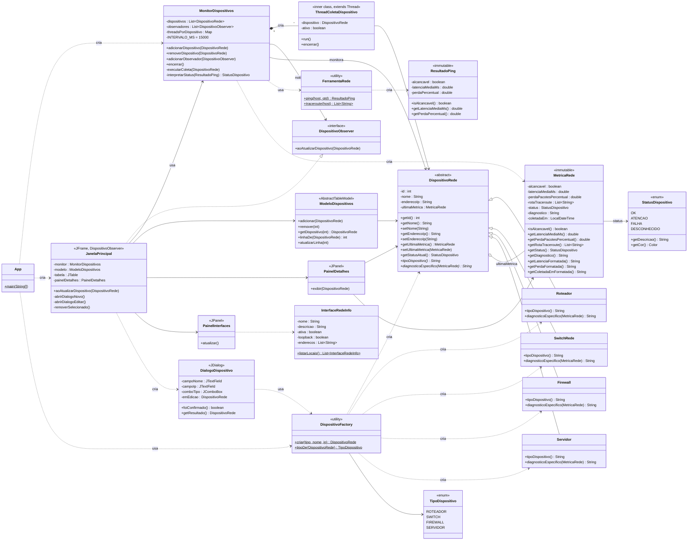
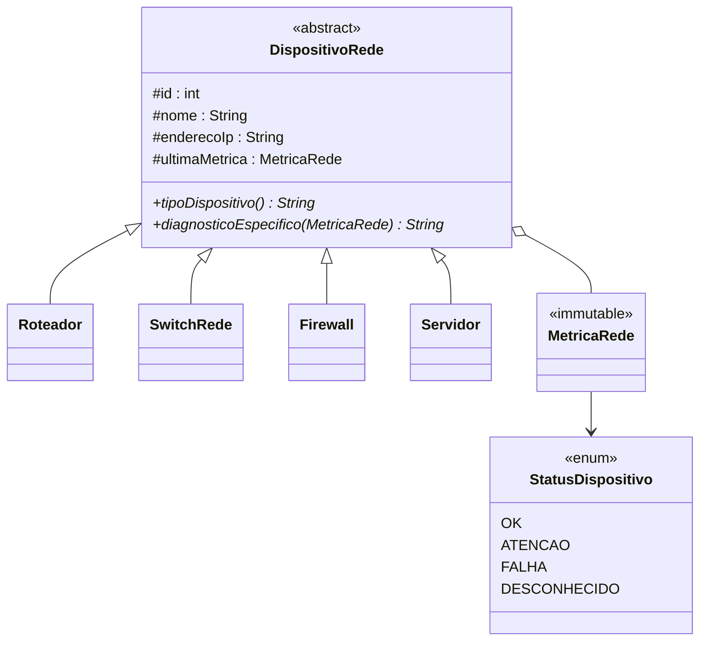
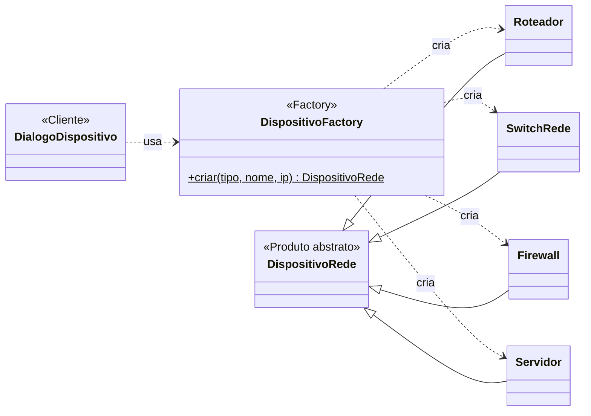
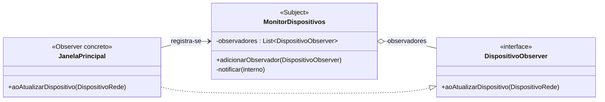
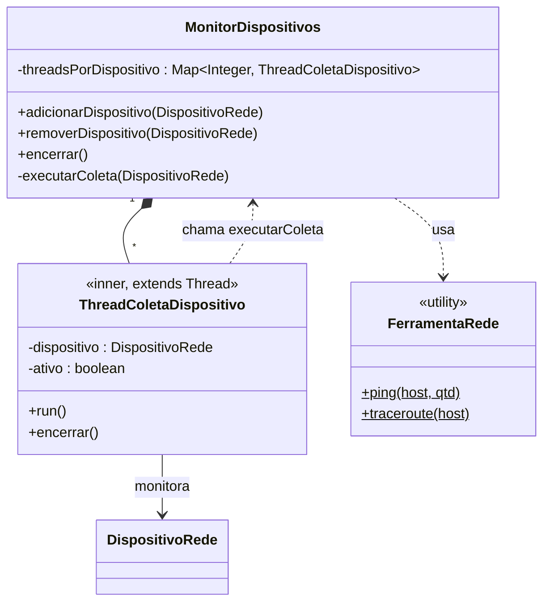
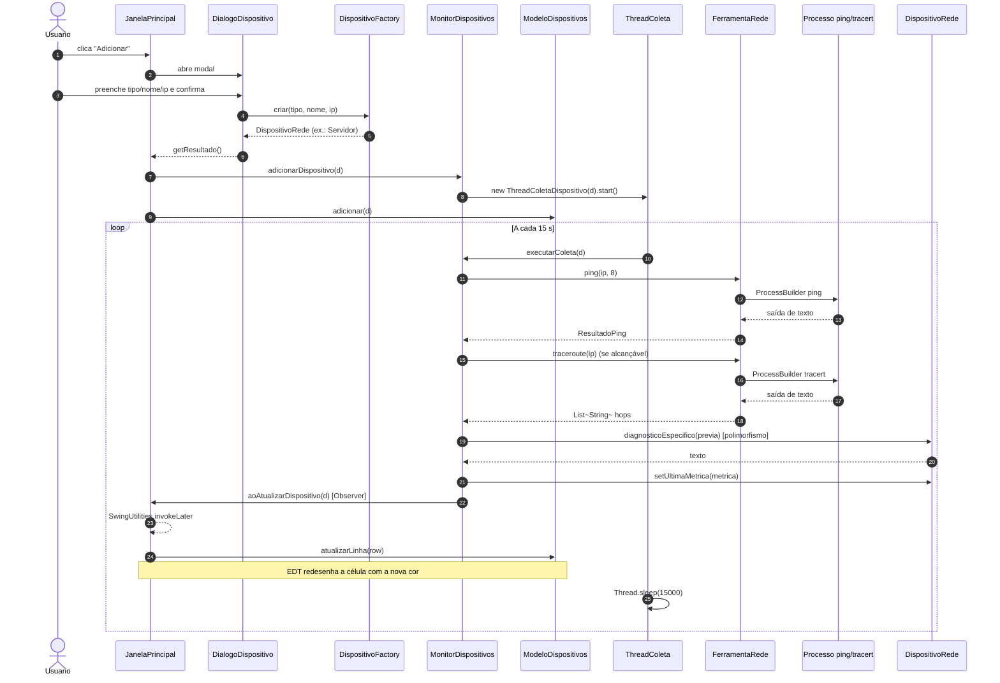
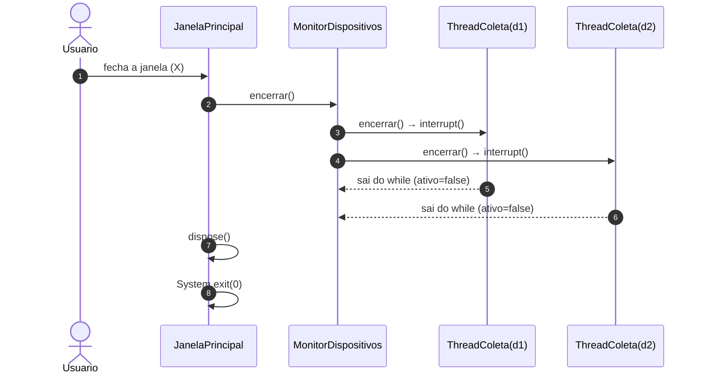

# Diagramas UML — Gerenciador de Dispositivos de Rede

Diagramas em [Mermaid](https://mermaid.js.org/) (renderizam
automaticamente no GitHub, GitLab e no preview do VS Code).

Índice:

1. Diagrama de classes completo
2. Diagrama de classes por pacote (visões parciais)
3. Diagrama de sequência — cadastro + coleta periódica
4. Diagrama de sequência — encerramento
5. Diagrama de componentes / camadas

---

## 1. Diagrama de classes completo



---

## 2. Diagramas por pacote (visões parciais)

### 2.1 Pacote `model` — polimorfismo em foco



### 2.2 Padrão Factory Method — visão focada



### 2.3 Padrão Observer — visão focada



### 2.4 Pacote `monitor` — threads



---

## 3. Diagrama de sequência — cadastro + coleta periódica



---

## 4. Diagrama de sequência — encerramento



---

## 5. Diagrama de componentes / camadas

```mermaid
flowchart TB
    subgraph GUI["gui/ — camada de apresentação (Swing)"]
        JP[JanelaPrincipal<br/>JFrame + Observer]
        DD[DialogoDispositivo<br/>JDialog]
        PD[PainelDetalhes<br/>JPanel]
        PI[PainelInterfaces<br/>JPanel]
        MD[ModeloDispositivos<br/>AbstractTableModel]
    end

    subgraph MON["monitor/ — camada de threads"]
        MDS[MonitorDispositivos]
        OBS[DispositivoObserver<br/>interface]
        TC[ThreadColetaDispositivo<br/>extends Thread]
    end

    subgraph SRV["service/ — I/O e criação"]
        FR[FerramentaRede<br/>ping + traceroute]
        DF[DispositivoFactory<br/>Factory Method]
        IR[InterfaceRedeInfo]
        RP[ResultadoPing]
    end

    subgraph MOD["model/ — domínio"]
        DR[DispositivoRede<br/>abstract]
        SUB[Roteador · SwitchRede<br/>Firewall · Servidor]
        MR[MetricaRede]
        SD[StatusDispositivo<br/>enum]
    end

    subgraph SO["Sistema Operacional"]
        PING[ping]
        TRACERT[tracert / traceroute]
        NIC[NetworkInterface API]
    end

    APP((App.java))

    APP --> MDS
    APP --> JP
    APP --> DF

    JP -- registra --> MDS
    JP -- implementa --> OBS
    JP --> DD
    JP --> PD
    JP --> PI
    JP --> MD

    DD --> DF
    DF --> DR
    DR <|-- SUB
    DR --> MR
    MR --> SD

    MDS --> OBS
    MDS --> TC
    MDS --> FR
    TC --> DR
    MDS -.->|"chama diagnosticoEspecifico"| DR

    FR --> PING
    FR --> TRACERT
    IR --> NIC
    PI --> IR
    PD --> DR
    PD --> MR
    MD --> DR
```

---

## Observação sobre o arquivo `UMLProject.png`

Existe também um `UMLProject.png` na raiz do projeto (imagem gerada por
ferramenta externa). Este arquivo `.md` complementa esse PNG com
diagramas em texto (versionáveis no Git, editáveis, sempre em dia com
o código).
