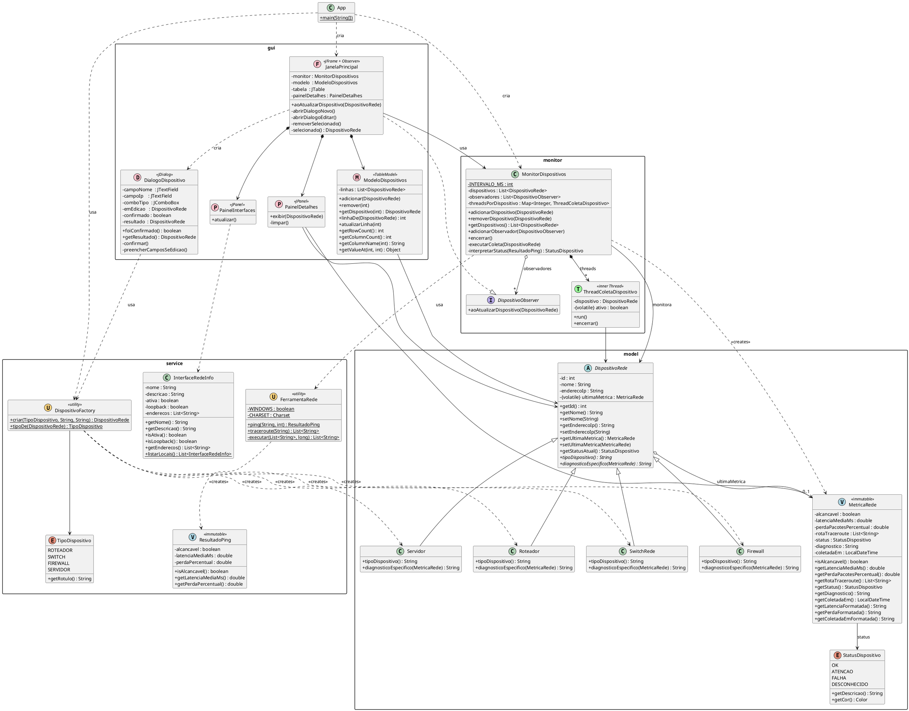
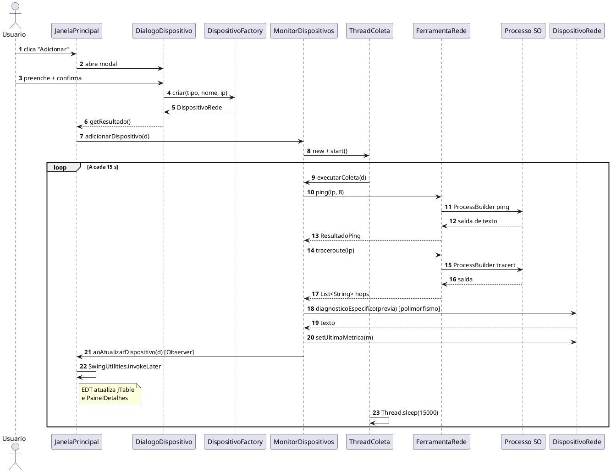
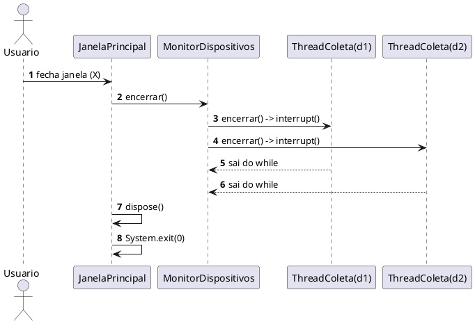

# Diagrama UML Completo — Versão Texto (sem Mermaid)

Este arquivo tem o UML do projeto em **dois formatos gratuitos**:

1. **ASCII puro** — visível em qualquer editor, GitHub, Notepad, terminal.
2. **PlantUML** — cole em https://www.plantuml.com/plantuml (gratuito, sem
   cadastro) e ele gera PNG/SVG. Também há a extensão gratuita "PlantUML"
   para VS Code (busque por "jebbs.plantuml").

Índice:

- 1. Legenda de notação UML
- 2. Diagrama de classes completo (ASCII)
- 3. Diagramas por pacote (ASCII)
  - 3.1 Pacote `model`
  - 3.2 Pacote `service`
  - 3.3 Pacote `monitor`
  - 3.4 Pacote `gui`
- 4. Diagramas de sequência (ASCII)
  - 4.1 Cadastro + primeira coleta
  - 4.2 Ciclo periódico
  - 4.3 Encerramento
- 5. Fonte PlantUML completa (pode colar no plantuml.com)

---

## 1. Legenda de notação UML

```
+---------------------+       +-----------------+
|  <<abstract>>       |       |  <<interface>>  |
|  NomeClasse         |       |  NomeInterface  |
+---------------------+       +-----------------+
| - atributoPrivado   |       | + metodo()      |
| # atributoProtegido |       +-----------------+
| + atributoPublico   |
| ~ atributoPacote    |
+---------------------+
| + metodo() : Tipo   |
| + metAbstrato() *   |   * = método abstrato
| + metStatico() $    |   $ = método estático
+---------------------+

Relações:

  A <|-- B       B herda de A  (extends)
  A <|.. B       B implementa A  (implements interface)
  A o-- B        A tem uma referência para B (agregação)
  A *-- B        A é dono de B (composição — B morre com A)
  A --> B        A conhece B (associação direcional)
  A ..> B        A usa B temporariamente (dependência)
  A "1" -- "*" B multiplicidade (1 A tem muitos B)
```

---

## 2. Diagrama de classes completo (ASCII)

```
                                    +-----------+
                                    |   App     |
                                    |-----------|
                                    | + main() $|
                                    +-----+-----+
                                          |
                cria                      | cria
      +-----------------------------------+---------------------+
      v                                                         v
+-----------------------+                              +--------------------+
|  MonitorDispositivos  |<-------- registra ---------->|  JanelaPrincipal   |
|-----------------------|          (observador)        |  (JFrame)          |
| - dispositivos:List   |                              |--------------------|
| - observadores:List   |----- notifica ----------->   | - monitor          |
| - threads:Map         |    (via interface abaixo)    | - modelo           |
| INTERVALO_MS = 15000  |                              | - tabela:JTable    |
|-----------------------|                              | - painelDetalhes   |
| + adicionarDisp()     |                              |--------------------|
| + removerDisp()       |                              | + aoAtualizarDisp()|
| + adicionarObs()      |                              | - abrirDialogoNovo |
| + encerrar()          |                              | - abrirDialogoEdit |
| - executarColeta()    |                              | - removerSelec.()  |
| - interpretarStatus() |                              +---------+----------+
+-----------+-----------+                                        |
            |*                                                   |
            | cria/possui                                        | implementa
            v                                                    v
+-----------------------+                              +-------------------+
| ThreadColetaDisposit. |                              | <<interface>>     |
|  (classe interna,     |                              | DispositivoObserv.|
|   extends Thread)     |                              |-------------------|
|-----------------------|                              | + aoAtualizarDisp |
| - dispositivo         |                              |     (Dispositivo) |
| - ativo:boolean       |                              +-------------------+
|-----------------------|
| + run()               |
| + encerrar()          |
+-----------------------+
            |
            | monitora
            v
+-------------------------------------------------+
|                <<abstract>>                     |
|                DispositivoRede                  |
|-------------------------------------------------|
| - id : int (AtomicInteger)                      |
| - nome : String                                 |
| - enderecoIp : String                           |
| - ultimaMetrica : MetricaRede  (volatile)       |
|-------------------------------------------------|
| + getId() : int                                 |
| + getNome() / setNome()                         |
| + getEnderecoIp() / setEnderecoIp()             |
| + getUltimaMetrica() / setUltimaMetrica()       |
| + getStatusAtual() : StatusDispositivo          |
| + tipoDispositivo() : String                *   |
| + diagnosticoEspecifico(MetricaRede):String *   |
+------------------+------------------------------+
                   ^
       +-----------+-----------+-----------+
       |           |           |           |
+-----------+ +-----------+ +----------+ +----------+
| Roteador  | | SwitchRede| | Firewall | | Servidor |
|-----------| |-----------| |----------| |----------|
| +tipoDisp.| | +tipoDisp.| | +tipoDisp| | +tipoDisp|
| +diagn.() | | +diagn.() | | +diagn.()| | +diagn.()|
+-----------+ +-----------+ +----------+ +----------+

+-----------------------------+       +----------------------------+
|       MetricaRede           |       |     StatusDispositivo      |
|      <<immutable>>          |------>|         <<enum>>           |
|-----------------------------|status |----------------------------|
| - alcancavel : boolean      |       | OK       (verde)           |
| - latenciaMediaMs : double  |       | ATENCAO  (amarelo)         |
| - perdaPacotesPct : double  |       | FALHA    (vermelho)        |
| - rotaTraceroute:List<Str>  |       | DESCONHECIDO (cinza)       |
| - status : StatusDispositivo|       |----------------------------|
| - diagnostico : String      |       | + getDescricao() : String  |
| - coletadaEm : LocalDateTime|       | + getCor() : Color         |
|-----------------------------|       +----------------------------+
| + isAlcancavel()            |
| + getLatenciaMediaMs()      |
| + getPerdaPacotesPct()      |
| + getRotaTraceroute()       |
| + getStatus()               |
| + getDiagnostico()          |
| + getLatenciaFormatada()    |
| + getPerdaFormatada()       |
| + getColetadaEmFormatada()  |
+-----------------------------+
              ^
              | ultimaMetrica (0..1)
              |
     [DispositivoRede — mostrado acima]


======================== PACOTE service ========================

+-----------------------------+       +-----------------------------+
|   <<utility>>               |       |     TipoDispositivo         |
|   DispositivoFactory        |------>|       <<enum>>              |
|-----------------------------|  usa  |-----------------------------|
| + criar(tipo,nome,ip)$      |       | ROTEADOR                    |
|      : DispositivoRede      |       | SWITCH                      |
| + tipoDe(Dispositivo)$      |       | FIREWALL                    |
|      : TipoDispositivo      |       | SERVIDOR                    |
+-------------+---------------+       +-----------------------------+
              |
              | ..> cria (via new)
              v
    [Roteador / SwitchRede / Firewall / Servidor — mostrados acima]


+-----------------------------+       +-----------------------------+
|   <<utility>>               |       |      ResultadoPing          |
|   FerramentaRede            |------>|      <<immutable>>          |
|-----------------------------| cria  |-----------------------------|
| WINDOWS : boolean $         |       | - alcancavel : boolean      |
| CHARSET : Charset $         |       | - latenciaMediaMs : double  |
|-----------------------------|       | - perdaPercentual : double  |
| + ping(host, qtd)$          |       |-----------------------------|
|     : ResultadoPing         |       | + isAlcancavel()            |
| + traceroute(host)$         |       | + getLatenciaMediaMs()      |
|     : List<String>          |       | + getPerdaPercentual()      |
| - executar(cmd, timeout)$   |       +-----------------------------+
+-------------+---------------+
              |
              | invoca (ProcessBuilder)
              v
     +----------------------------+
     |  Sistema Operacional       |
     |  ping / tracert /          |
     |  traceroute                |
     +----------------------------+


+-------------------------------------------+
|            InterfaceRedeInfo              |
|-------------------------------------------|
| - nome : String                           |
| - descricao : String                      |
| - ativa : boolean                         |
| - loopback : boolean                      |
| - enderecos : List<String>                |
|-------------------------------------------|
| + getNome() / getDescricao() / ...        |
| + listarLocais() $ : List<InterfaceRede>  |
+-------------------+-----------------------+
                    |
                    | usa
                    v
        +---------------------------+
        | java.net.NetworkInterface |
        +---------------------------+


======================== PACOTE gui ========================

+----------------------------+       +----------------------------+
|      JanelaPrincipal       |       |      DialogoDispositivo    |
|    (JFrame + Observer)     |------>|         (JDialog)          |
|----------------------------| cria  |----------------------------|
| - monitor                  |       | - campoNome : JTextField   |
| - modelo : ModeloDisposit. |       | - campoIp   : JTextField   |
| - tabela  : JTable         |       | - comboTipo : JComboBox    |
| - painelDetalhes           |       | - emEdicao : DispositivoR. |
|----------------------------|       | - confirmado : boolean     |
| + aoAtualizarDispositivo() |       | - resultado : DispositivoR.|
| - abrirDialogoNovo()       |       |----------------------------|
| - abrirDialogoEditar()     |       | + foiConfirmado()          |
| - removerSelecionado()     |       | + getResultado()           |
| - selecionado()            |       | - confirmar()              |
| + RendererStatus (inner)   |       | - preencherCamposSeEdicao()|
+------+---------+-----------+       +--------+-------------------+
       |         |                            |
       v         v                            | usa
+-----------+ +-------------+                 v
|PainelDet. | |PainelInter. |       +-----------------------+
| (JPanel)  | | (JPanel)    |       | DispositivoFactory    |
+-----------+ +-------------+       +-----------------------+
       |
       v
+-------------------------------+
|      ModeloDispositivos       |
|    (AbstractTableModel)       |
|-------------------------------|
| - linhas : List<Dispositivo>  |
| - COLUNAS : String[]          |
|-------------------------------|
| + adicionar(Dispositivo)      |
| + remover(int)                |
| + getDispositivo(int)         |
| + linhaDe(Dispositivo) : int  |
| + atualizarLinha(int)         |
| + getRowCount / getColumnName |
| + getValueAt(row, col)        |
+-------------------------------+
```

---

## 3. Diagramas por pacote (ASCII)

### 3.1 Pacote `model` (polimorfismo em destaque)

```
                    +-----------------------------+
                    |       <<abstract>>          |
                    |      DispositivoRede        |
                    |-----------------------------|
                    | - id, nome, enderecoIp      |
                    | - ultimaMetrica (volatile)  |
                    |-----------------------------|
                    | + tipoDispositivo() *       |
                    | + diagnosticoEspecifico() * |
                    +-------------+---------------+
                                  ^
       +---------------+----------+----------+---------------+
       |               |                     |               |
+-------------+ +-------------+       +-------------+ +-------------+
|  Roteador   | |  SwitchRede |       |  Firewall   | |  Servidor   |
+-------------+ +-------------+       +-------------+ +-------------+
| alerta se   | | espera lat. |       | ICMP pode   | | perda>0 ou  |
| rota > 15   | | baixa (<20) |       | estar       | | lat>80 é    |
| saltos      | | em LAN      |       | bloqueado   | | alerta      |
+-------------+ +-------------+       +-------------+ +-------------+


+-----------------------------+       +----------------------------+
|       MetricaRede           |       |     StatusDispositivo      |
|      <<immutable>>          | ----> |         <<enum>>           |
+-----------------------------+ status +----------------------------+
                                       | OK / ATENCAO /             |
                                       | FALHA / DESCONHECIDO       |
                                       +----------------------------+
```

### 3.2 Pacote `service` (foco no Factory Method)

```
+----------------------+        +------------------------+
|   <<Cliente>>        |        |   <<Factory>>          |
| DialogoDispositivo   |------->| DispositivoFactory     |
+----------------------+  usa   +------------------------+
                                | + criar(tipo,nome,ip)$ |
                                +-----------+------------+
                                            | cria
                                            v
                                +------------------------+
                                | <<Produto abstrato>>   |
                                |    DispositivoRede     |
                                +-----------+------------+
                                            ^
                        +----------+--------+--------+----------+
                        |          |                 |          |
                    Roteador  SwitchRede         Firewall   Servidor
                                (Produtos concretos)


+----------------------+       +---------------------+
|    FerramentaRede    |------>|    ResultadoPing    |
|    <<utility>>       | cria  |    <<immutable>>    |
+----------------------+       +---------------------+
| + ping(host, qtd)$   |
| + traceroute(host)$  |
+----------------------+
           |
           | ProcessBuilder
           v
    (comandos do SO)


+----------------------+
|  InterfaceRedeInfo   |------> java.net.NetworkInterface
+----------------------+
| + listarLocais() $   |
+----------------------+
```

### 3.3 Pacote `monitor` (Observer + threads)

```
+------------------------+       +------------------------+
|    <<Subject>>         |       |     <<interface>>      |
|  MonitorDispositivos   | o---->|   DispositivoObserver  |
+------------------------+ lista +------------------------+
| dispositivos : List    | de    | + aoAtualizarDisp(...) |
| observadores : List    | obs   +-----------+------------+
| threads : Map          |                   ^
+-----------+------------+                   |
            | *                              | implementa
            | cria/possui                    |
            v                     +-------------------+
+------------------------+        |  JanelaPrincipal  |
| ThreadColetaDispositivo|        |  (Observer concr.)|
| (inner, extends Thread)|        +---------+---------+
+------------------------+                  |
| + run() [loop:         |                  | registra-se
|   coleta + sleep(15s)] |                  v
| + encerrar()           |        (chama monitor.adicionarObservador)
+------------------------+
```

### 3.4 Pacote `gui`

```
                    +----------------------------+
                    |    JanelaPrincipal         |
                    |  JFrame + Observer         |
                    +-------------+--------------+
                                  | contém
        +-----------+-------------+-------------+-------------+
        |           |             |             |             |
        v           v             v             v             v
+-----------+ +-----------+ +----------+ +----------+ +------------+
| JToolBar  | | JTabbed-  | | JSplit-  | | JTable + | | Painel-    |
|(3 botões) | |  Pane     | |  Pane    | | Modelo   | | Detalhes   |
+-----------+ +-----+-----+ +----------+ +----------+ +------------+
                    |
       +------------+------------+
       v                         v
+---------------+       +---------------------+
|  Aba          |       |  Aba                |
| "Dispositivos"|       | "Interfaces de Rede"|
+---------------+       +---------------------+
                              |
                              v
                     +---------------------+
                     |  PainelInterfaces   |
                     |  (JPanel + JTable)  |
                     +---------------------+


Diálogo modal (aberto sob demanda):

+---------------------------+
|   DialogoDispositivo      |
|   (JDialog modal)         |
|---------------------------|
| Tipo:   [combo]           |
| Nome:   [text field]      |
| IP/Host:[text field]      |
|                           |
|      [Confirmar][Cancelar]|
+---------------------------+
```

---

## 4. Diagramas de sequência (ASCII)

### 4.1 Cadastro + primeira coleta

```
Usuário    JanelaPrincipal   Dialogo    Factory    Monitor    Thread    Ferramenta   SO(ping/tracert)   Disposit.
  |             |               |          |          |          |            |              |            |
  |--Add------->|               |          |          |          |            |              |            |
  |             |--abre modal-->|          |          |          |            |              |            |
  |--preenche + confirma------->|          |          |          |            |              |            |
  |             |               |--criar-->|          |          |            |              |            |
  |             |               |<--Disp.--|          |          |            |              |            |
  |             |<-getResult.---|          |          |          |            |              |            |
  |             |------------adicionarDisp.---------->|          |            |              |            |
  |             |                                     |--new+start(Thread)--->|            |              |            |
  |             |                                                 |                                       |            |
  |             |                                                 |--executarColeta--------|              |            |
  |             |                                                 |                        |--ping()----->|            |
  |             |                                                 |                        |              |--ProcBuild->|
  |             |                                                 |                        |              |<---saída---|
  |             |                                                 |                        |<--Resultado--|            |
  |             |                                                 |                        |--traceroute->|            |
  |             |                                                 |                        |<--hops-------|            |
  |             |                                                 |<-diagnosticoEspecífico-|--------------------------->|  [polimorfismo]
  |             |                                                 |                                                    |
  |             |                                                 |--setUltimaMetrica---------------------------------->|
  |             |<---aoAtualizarDispositivo(d)---(observer)-------|                                                    |
  |             |    (executa em thread do monitor)                                                                    |
  |             |--SwingUtilities.invokeLater----+                                                                     |
  |             |                                v                                                                     |
  |             |                       (EDT: atualiza JTable e PainelDetalhes)                                        |
  |             |                                                 |                                                    |
  |             |                                                 |--Thread.sleep(15000)                               |
  |             |                                                 |  (aguarda próximo ciclo)                            |
```

### 4.2 Ciclo periódico (loop)

```
Thread(d)         Monitor          Ferramenta     SO          Dispositivo   JanelaPrincipal
   |                 |                  |          |               |               |
   |--(loop while ativo)                                                            |
   |                 |                                                              |
   |--executarColeta(d)----->|                                                      |
   |                 |--ping(ip, 8)---->|--proc--->|                                |
   |                 |<--ResultadoPing--|<--saída--|                                |
   |                 |                                                              |
   |                 |  (se alcançável) |                                           |
   |                 |--traceroute(ip)->|--proc--->|                                |
   |                 |<--List<hops>-----|<--saída--|                                |
   |                 |                                                              |
   |                 |--diagnosticoEspecífico(previa)---------->|                   |
   |                 |<--texto----------------------------------|                   |
   |                 |--setUltimaMetrica(metrica)-------------->|                   |
   |                 |                                                              |
   |                 |--aoAtualizarDispositivo(d)--(Observer)--------------------->|
   |                 |                                                              |--invokeLater
   |                 |                                                              |    (EDT)
   |<---volta do executarColeta-|                                                   |    modelo.atualizarLinha
   |                                                                                |    painelDetalhes.exibir
   |--Thread.sleep(15000)                                                           |
   |                                                                                |
   |--(volta ao topo do loop)                                                       |
```

### 4.3 Encerramento

```
Usuário   JanelaPrincipal   Monitor     Thread(d1)    Thread(d2)
   |             |              |             |             |
   |--fecha (X)->|              |             |             |
   |             |--encerrar()->|             |             |
   |             |              |--encerrar()->|            |
   |             |              |              |->interrupt()
   |             |              |--encerrar()------------->|
   |             |              |                          |->interrupt()
   |             |              |<--(saem do while ativo)  |
   |             |              |<--(saem do while ativo)------|
   |             |<-------------|                                
   |             |--dispose()                                    
   |             |--System.exit(0)                               
```

---

## 5. Fonte PlantUML completa

Cole todo o bloco abaixo em https://www.plantuml.com/plantuml para
renderizar como PNG/SVG (é gratuito, sem cadastro).

Alternativa local: instale a extensão gratuita **PlantUML** (autor
"jebbs") no VS Code, salve o bloco em um arquivo `.puml` e aperte
`Alt+D` para pré-visualizar.



### 5.1 Sequência em PlantUML — cadastro + coleta



### 5.2 Sequência em PlantUML — encerramento



---

## Dicas para gerar/exportar

- **Plantuml.com (online, sem instalação)**:
  1. Abra https://www.plantuml.com/plantuml
  2. Cole qualquer bloco `@startuml ... @enduml` do item 5.
  3. Salve o PNG/SVG gerado — pode colocar na apresentação/slide.

- **VS Code (offline, extensão gratuita)**:
  1. `Ctrl+P` → `ext install jebbs.plantuml`
  2. Crie um arquivo `diagrama.puml` com o conteúdo do bloco.
  3. Aperte `Alt+D` para abrir o preview lado a lado.
  4. Clique com o botão direito → **Export Current Diagram**
     → escolha PNG ou SVG.

- **Editor online (com histórico e edição colaborativa)**:
  https://planttext.com — também gratuito, sem cadastro.
